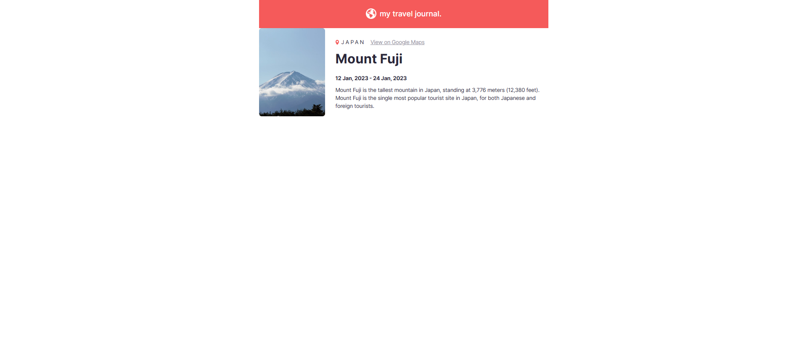
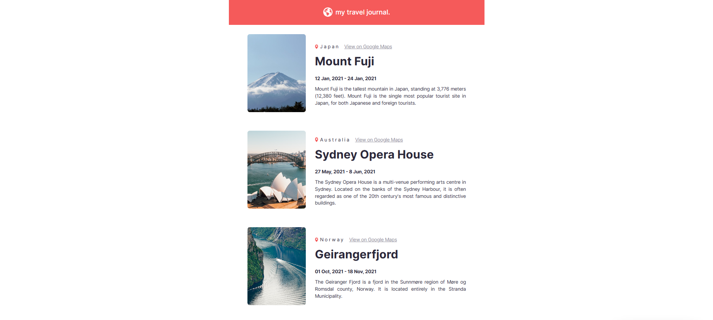

# Travel Journal — Learning Project (screenshots below)

Live Demo: https://travel-journal-mu-six.vercel.app/  

**Note:** This was a pure learning project. No AI code tools, generators, or autopilot were used. Every line of code was written manually to build real hands-on React experience.

## Overview

This project is part of my React learning path and focuses on understanding how to build reusable, data-driven UI using props and mapped components.  
The goal wasn’t to build a complex product, but to learn how React components communicate, how props work, and how arrays can be rendered dynamically.

The app displays a travel journal layout where each entry is generated from a data file rather than being hard-coded.

## What I Learned

This project reinforced:

- Passing props into components  
- Destructuring props for cleaner code  
- Creating reusable and scalable components  
- Rendering UI from arrays using `.map()`  
- Understanding and applying the `key` prop  
- Passing objects as props  
- Using the spread operator with components  
- Importing static assets in React  
- Organizing code using a component-based file structure  

These concepts came from the Scrimba React module covering props, JSX expressions, mapping, and reusable components.

## Features

- Dynamic list rendering from an external `data.js` file  
- Reusable `Entry` component  
- Component-specific CSS  
- Clean and minimal project structure  
- Static assets loading via Vite  
- Fully handwritten code for learning purposes  

## Purpose

This project exists purely for learning React fundamentals.  
It helped solidify concepts like reusable UI, props, mapping data to components, and keeping a clean folder structure.

## Screenshots

### Header completed and layout shaping


### First component wired in


### Final Version


## Tech Stack

- React (functional components, JSX)
- Vite (dev server + bundler)
- JavaScript (ES6+)
- HTML
- CSS

## File Structure

```
src/
 ├─ assets/
 │   ├─ australia.png
 │   ├─ japan.png
 │   ├─ norway.png
 │   ├─ pin.svg
 │   └─ react.svg
 ├─ components/
 │   ├─ Header.jsx
 │   ├─ Header.css
 │   ├─ Entry.jsx
 │   └─ Entry.css
 ├─ App.jsx
 ├─ App.css
 ├─ data.js
 ├─ index.css
 └─ main.jsx

public/
 ├─ 1component.png
 ├─ headerDone.png
 ├─ final.png
 └─ vite.svg
```


## How to Run

Install dependencies:

```
npm install
```

Start the development server:

```
npm run dev
```
